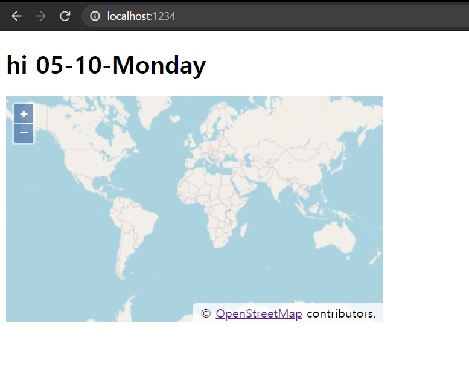
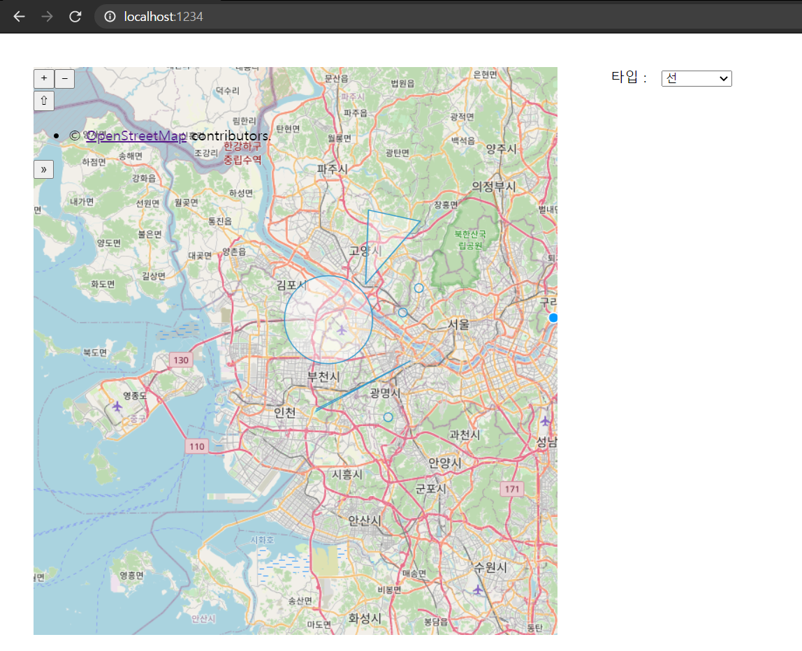

Use MarkDown Library
===

## April 29th 

## 1. How to Use OL

openLayer는 브라우저에서 지도를 활용한 정보를 표출하는 라이브러리이다.

네이버,다음,구글 처럼 GIS(Geographic Information System)라는 명칭으로 불리며 지형벙보 서버를 따로 구축 할 수 있어서 외부 인터넷이 안 되는 곳에서 종종 사용한다.

OL(OpenLayers)는 ES5, ES6 문법 지원.
##### ※ ES6는 IE에서 지원하지 않음 ※

이번 공부에선 Node.js의 npm을 활용해 개발하고자 함.

1. openLayer란 폴더 생성
2. 폴더 내에서 npm init 실행
3. 아래처럼 package.json 생성 <br/>
```
{
  "name": "open_test",
  "version": "1.0.0",
  "description": "\"\"",
  "main": "map.js",
  "scripts": {
    "test": "\"\"",
    "start": "parcel olPrc1.html"
  },
  "repository": {
    "type": "git",
    "url": "https://github.com/whdudal1217/javascriptStudy.git"
  },
  "keywords": [
    "1217"
  ],
  "author": "1217",
  "license": "ISC"
}<br/>
```

 ※ package.json에 대한 설명 ※

 프로젝트의 이름, 버전, 의존패키지 리스트 등 정보들에 대한 정보를 담고있는 파일
 
 { <br />
&nbsp;&nbsp;&nbsp;&nbsp;&nbsp;&nbsp; "key" : "value" 형태
 <br /> }

| KEY | VALUE |
|------|------|
|NAME|프로젝트의 이름. <P> 중앙 저장소에 배포 될 때, VERSION과 함께 필수 항목.|
|VERSION|프로젝트의 버전.|
|DESCRIPTION|프로젝트에 대한 설명으로, 타인이 패키지를 찾아내고 이해하는데 도움.|
|KEYWORDS|프로젝트를 검색 할 때 참조되는 키워드. <P>(DESCRIPTION과 유사) |
|HOMEPAGE|프로젝트 홈페이지의 주소.|
|AUTHOR|프로젝트 작성자 정보.|
|CONTRIBUTORS|프로젝트 참여자 정보.|
|REPOSITORY|프로젝트의 소스코드를 지정한 저장소의 정보.<P>HOMEPAGE URL을 적으면 안 됨. </P>|
|SCRIPTS|프로젝트에서 자주 실행되는 명령어를 작성. <P> NPM 명령어로 실행이 가능함.|
|CONFIG|소스 코드에서 환경변수처럼 사용 할 수 있음.|
|PRIVATE|TRUE/FALSE 의 값으로 TRUE 설정 시 중앙 저장소에 저장하지 않음.|
|DEPENDENCIES|프로젝트 의존성 관리를 위한 부분.<P>이 프로젝트가 어떤 확장모듈을 필요로 하는지 정리 할 수 있는 부분.<P> 애플리케이션을 설치 할 때 이곳을 참조하여 필요한 확장 모듈 자동 설치하므로 특정 확장 모듈이 꼭 필요한 애플리케이션이라면 꼭 명시.<P> 또한, NPM INSTALL 명령은 여기에 포함된 모든 확장 모듈을 설치함.|
|DEVDEPENDENCIES|개발할 때만 필요한 확장모듈.|
|ENGINE|실행 가능한 노드버전 범위.|

<br />
 ※ package.json에 대한 설명 끝 ※

<br />
<br />

4. npm install ol 실행 
##### ※ 네트워크 연결된 곳에서 해야함 ※
5. npm install --save-dev parcel-bundler 실행 <br />
    ##### 자동으로 테스트 서버를 올려주고 결과파일을 만들어주는 라이브러리
/
<br />

7. olPrc1.html 
```
    <!DOCTYPE html>
    <html lang="en">
    <head>
        <meta charset="UTF-8">
        <meta http-equiv="X-UA-Compatible" content="IE=edge">
        <meta name="viewport" content="width=device-width, initial-scale=1.0">
        <style>
            #map{
                width: 500px;
                height: 300px;
            }
        </style>
        <title>ol</title>
    </head>
    <body>
        <div id="map"></div>
        <script src="./map.js"></script>
    </body>
    </html>
```
8. map.js 
```
import 'ol/ol.css';
import {Map, View} from 'ol';
import TileLayer from 'ol/layer/Tile';
import OSM from 'ol/source/OSM';

const map = new Map({
    target:'map',
    layers:[
        new TileLayer({
            source : new OSM()
        })
    ],
    view:new View({
        center:[0,0],
        zoom:0
    })
});
```
----
### 결과
</img>

----

9. 만약 해당 파일을 다른 곳에서도 사용하고 싶다면 npm run Build 실행
  이 파일을 다른 곳에서도 사용하고 싶어진다면 npm run build 실행.
  build하는 순간 package.json이 동작합니다.
  parcel이라는 라이브러리가 openLayers에서 임포트한 내용을 알아서 정리하고 웹 서버에 사용 가능하도록 압축.

10. dist 폴더가 생성이 되면서 여러가지 파일이 같이 생성된다.
11. 실제 build한 파일을 http-server로 동작시키기

<br/>

---

<br/>

## April 29th

## 2. Latitude Longitude Transfer

1. How to use the Point

- Javascript File
```
    import point from 'ol/geom/Point';

    var pnt = new point([126,37]).transform('EPSG:4326', 'EPSG:3857'); //위-경도 변환
    var changePoints = pnt.getCoordinates(); //1차원배열 크기 2개의 값 [x, y]

    var layer = new TileLayer({
        source: new OSM() //지형정보가 존재하는 객체, OpenLayer에서 제공하는 기본 레이어
    });

    var source = new VectorSource();

    var vector = new VectorLayer({
        source:source
    });

    var map = new Map({
        layers:[layer,vector], //사용하는 레이어, 벡터레이어를 추가해야 이벤트에 따른 원그리기, 선그리기 객체를 지도에 추가할 수 있다.
        target:'map',
        view:new View({
            center:changePoints, //center잡기
            zoom:8
        })
    })

```

<br/>


> Point 클래스와 좌표계 바꾸는 방법

ol/geom/Point -> Point가 위도/경도를 바꿔주는 클래스이다.
Point 안에 .transform() 이란 메소드가 좌표계를 바꿔줌.
<br/>

```
    var pnt = new Point([126,37]).transform('EPSG:4326','EPSG:3857');
```

new Point([위도,경도]).transform(현재 좌표계, 바꾸고 싶은 좌표계);

※EPSG:4326, EPSG:3857※ <br />
EPSG:4326 -> gps가 사용하는 좌표계 <br />
EPSG:3857 -> Google Map, Being Map이 사용하는 좌표계
<br/>
<br/>
<br/>

> getCoordinates()

```
    var changePoints = pnt.getCoordinates();
```

changePoints : 14026255.83995247,4439106.78725058

<br/>
<br/>
<br/>

> 타일레이어와 OSM이란?

```
    var layer = new TileLayer({
        source: new OSM()   
    });
```

new TileLayer(options) : pre-rendering 된 지도 이미지 <br/>
new OSM() : openStreetMap을 제공 해주는 생성자

※OSM※
<p>
영국의 오픈스트리트맵 재단에서 운영하는 오픈소스 방식의 참여형 무료 지도 서비스.

<br/>
<br/>
<br/>

> 벡터소스와 벡터레이어

```
    var source = new VectorSource();
```

벡터 레이어는 벡터 소스를 통해 구성되는데 벡터 소스는 Feature들의 집합이기도 하다. <br/>
레이어는 시각화 개념이 강하고 그에 따른 스타일 요소가 많음.
<br/>
freature : 점, 선, 다각형 등의 지도 위에 그려지는 도형들 
<br />

###### 즉, 벡터 = 지도 위에 그림그리기

※ 벡터 레이어 참고용 :  http://www.gisdeveloper.co.kr/?p=6228 ※

<br/>
<br/>
<br/>

> ol.org에서 설명하는 Map 사용법
```
var map = new Map({
  view: new View({
    center: [0, 0],
    zoom: 1
  }),
  layers: [
    new TileLayer({
      source: new OSM()
    })
  ],
  target: 'map'
});
```

생성자에 layers와 target은 필수요소 <br/>
- view 
  - center : 맵이 펼쳐졌을때 어디를 먼저 보여줄지를  결정하는 요소.
  - zoom : 줌
- layer 
  - layer : 지도
  - vector : feature 그리기
- target <br/>
&nbsp;&nbsp;&nbsp;&nbsp;&nbsp; : map을 그릴 div

<br />
<br />
<br />


- Html
```
    <!DOCTYPE html>
    <html lang="en">
    <head>
        <meta charset="UTF-8">
        <meta http-equiv="X-UA-Compatible" content="IE=edge">
        <meta name="viewport" content="width=device-width, initial-scale=1.0">
        <style>
            #map{
                width: 500px;
                height: 300px;
            }<br />
        </style>
        <title>ol</title>
    </head>
    <body>
        <div id="map" class="left"></div>
        <script src="./map.js"></script>
    </body>
    </html>
```

<br/>
<br/>
<br/>

2. How to draw line or some Shape 

- Javascript File
```
    // How to use the Point
    import Map from 'ol/Map.js';
    import View from 'ol/View.js';
    import Draw from 'ol/interaction/Draw.js';
    import {Tile as TileLayer, Vector as VectorLayer} from 'ol/Layer.js';
    import {OSM, Vector as VectorSource} from 'ol/source.js';
    import point from 'ol/geom/Point';

    var pnt = new point([126,37]).transform('EPSG:4326', 'EPSG:3857');
    var changePoints = pnt.getCoordinates(); 

    var layer = new TileLayer({
        source: new OSM() 
    });

    var source = new VectorSource();

    var vector = new VectorLayer({
        source:source
    });

    var map = new Map({
        layers:[layer,vector],
        target:'map',
        view:new View({
            center:changePoints,
            zoom:8
        })
    })

    var selector = document.getElementById('type'); 
    var draw = null; //그림 객체

    function startEvent(){ 
        var value = selector.value;
        if(value !== 'None'){
            draw = new draw({
                source:source,
                type: selector.value
            });
            map.addInteraction(draw); //구현된 map 객체에 이벤트 위치를 스스로 추가하여 그리는 부분
        }
    }

    selector.onchange = function(){
        map.removeInteraction(draw);
        startEvent();
    }

    startEvent();
```

- Html File
```
    <!DOCTYPE html>
    <html lang="en">
    <head>
        <meta charset="UTF-8">
        <meta http-equiv="X-UA-Compatible" content="IE=edge">
        <meta name="viewport" content="width=device-width, initial-scale=1.0">
        <style>
            #map{
                width: 500px;
                height: 300px;
            }
        </style>
        <title>ol</title>
    </head>
    <body>
        <div id="map" class="left"></div>
        <div class="left">
            <label> 타입 : &nbsp; </label>
            <select id="type">
                <option value="Point">점</option>
                <option value="LineString">선</option>
                <option value="Polygon">채우는 선</option>
                <option value="Circle">원형</option>
                <option value="None">없음</option>
            </select>
        </div>
        <script src="./map.js"></script>
    </body>
    </html>
```


----
### 결과
</img>

----


2. +1 Collision Issue & Circle with Text

원 도형을 그리는데 있어 import 부분이 계속 충돌을 함.

import 할 때 별칭을 주어야 한다고 함.
그래서 2번 소스에 별칭도 추가하고 원형과 글씨를 추가한 소스.

- Javascript file
```
    import Map from 'ol/Map.js';
    import OSM from 'ol/source/OSM.js';
    import OlTileLayer from 'ol/layer/Tile.js';
    import OlView from 'ol/View.js';
    import Vector from 'ol/source/Vector.js';
    import VectorLayer from 'ol/layer/Vector.js';
    import Point from 'ol/geom/Point';
    import {Circle} from 'ol/geom.js';
    import Feature from 'ol/Feature.js';
    import { Style,Stroke,Fill,Text} from 'ol/style.js';

    var pnt = new Point([126,37]).transform('EPSG:4326','EPSG:3857');
    var changePoints = pnt.getCoordinates();

    var layer = new OlTileLayer({
        source : new OSM()
    });

    var source = new Vector();

    var vector = new VectorLayer({
        source:source
    });

    var map = new Map({
        layers: [layer, vector],
        target: 'map',
        view: new OlView({
            center: changePoints,
            zoom:8
        })
    });

    var vectorSource = new Vector({projection:'EPSG:4326'});
    var circle = new Circle(changePoints, 12000); //좌표, 반경 넓이
    var CircleFeature = new Feature(circle); //구조체로 형성
    vectorSource.addFeatures([CircleFeature]); //벡터소스에 추가

    var VectorLayer = new VectorLayer({
        source:vectorSource,
        style:[
            new Style({
                stroke: new Stroke({
                    color: 'rgba(240,79,79,0.9)',
                    width: 2
                }),
                fill: new Fill({
                    color: 'rgba(255,133,133,0.5',
                }),
                text: new Text({
                    text: 'Test!',
                    textAlign: 'center',
                    font: '15px roboto,snas-serif'
                })
            })
        ]
    });

```

- Html file
```
    <!DOCTYPE html>
    <html lang="en">
    <head>
        <meta charset="UTF-8">
        <meta http-equiv="X-UA-Compatible" content="IE=edge">
        <meta name="viewport" content="width=device-width, initial-scale=1.0">
        <style>
            #map {
            width: 600px;
            height: 650px;
            }
            .left{
                float: left;
                margin: 2%;
            }
        </style>
        <title>ol</title>
    </head>
    <body>
        <div id="map" class="left"></div>
        <script src="./map.js"></script>
    </body>
    </html>
```
<br/>

-----

<br/>

## 3. OpenLayers HeatMap

히트맵, 열지도 그리는 방법은 Heatmaplayer를 생성하면 할 수 있다.
해당 레이어는 .kml 확장자 파일이 필요하다

- Kml

```
<?xml version="1.0" encoding="UTF-8"?>
<kml xmlns="http://earth.google.com/kml/2.0" xmlns:atom="http://www.w3.org/2005/Atom">
    <document>
        <name>2021 연습용 히트맵</name>
        <Folder>
            <name>AREA</name>
            <Placemark id="id1">
                <name>1</name>
                <magnitude>5.9</magnitude>
                <Point>
                    <coordinates>126.11, 37.12 </coordinates>
                </Point>
            </Placemark>
            <Placemark id="id2">
                <name>1</name>
                <magnitude>15.9</magnitude>
                <Point>
                    <coordinates>136.11, 38.12 </coordinates>
                </Point>
            </Placemark>
            <Placemark id="id3">
                <name>1</name>
                <magnitude>25.9</magnitude>
                <Point>
                    <coordinates>146.11, 39.12 </coordinates>
                </Point>
            </Placemark>
        </Folder>
    </document>
</kml>
```

- Javascript

```
    import Map from 'ol/Map.js';
    import OSM from 'ol/source/OSM.js';
    import OlTileLayer from 'ol/layer/Tile.js';
    import OlView from 'ol/View.js';
    import Vector from 'ol/source/Vector.js';
    import VectorLayer from 'ol/layer/Vector.js';
    import Point from 'ol/geom/Point';
    import {Circle} from 'ol/geom.js';
    import Feature from 'ol/Feature.js';
    import { Style,Stroke,Fill,Text} from 'ol/style.js';
    import KML from 'ol/format/KML.js';
    import {Heatmap as HeatmapLayer, Tile as TileLayer} from 'ol/layer.js';
    import VectorSource from 'ol/source/Vector.js';

    var pnt = new Point([126,37]).transform('EPSG:4326','EPSG:3857');
    var changePoints = pnt.getCoordinates();

    var layer = new OlTileLayer({
        source : new OSM()
    });

    var source = new Vector();

    var Vector = new HeatmapLayer({ //heatMap을 만드는 레이어
        source: new VectorSource({
            url: '/heating.kml',
            format: new KML({
                extractStyles: false
            })
        }),
        blur: 15,
        radius: 20
    })

    var map = new Map({
        layers: [layer, vector],
        target: 'map',
        view: new OlView({
            center: changePoints,
            zoom:8
        })
    });
```

<br/>

-----

<br/>

## 4. View Object

ol에선 View 객체는 화면구성을 담당한다.
화면에 뭔가 클릭 되거나 드래그, 드랍, 등등의 이벤트를 감지하고
처리하는 역할.

<br />
<br />
<br />

-----

# 5.11

<br />
npm으로 냅다 실행시키던 html을 동적으로 움직여보고자 express 프레임워크를 깔아서 실행하고 있다.<br />

```
<script src="../js/map1.js"></script>
```

html에서 이 구문이 실행되지 않았다.. <br />

```
app.use('/js', express.static('./js/'));
``` 
<br />
server 설정을 한 js 파일에 이 구문을 꼭 추가해야한다 <br />

참고로 내 express 파일 구조는 <br />

- openLayer
  - js
    - map1.js
    - map2.js
    - ...
  - route
    - main.js
    - ...
  - views
    - main.html
    - olPrc1.html
    - olPrc2.html
    - ...
  - server.js

  
<br />
<br />
<br />

-----

# 5.12.1

<br />

>express 프레임워크를 사용해 서버를 돌리던 중 import가 제대로 되지 않았고
js의 모듈에 대해서 알게 됨.

##### 나는 지금까지 ``` <script> ``` 를 통해서 외부 js 파일을 들여왔음. <br />
##### import도 require도 처음 써봐서 신기함. <br/>
<br/>

NodeJs는 최신 자바스크립트 문법들은 지원하지만, 모듈 시스템으로 CommonJs를 채택했기 때문에 ES 모듈 시스템은 사용할 수 없다고 한다. 
<br/>
<br/>
- commonJs의 모듈 적용 방식
```
// 모듈 전체를 import
var module = require('./someModule.js')

// 모든 속성 import
// (위의 module 객체에 모든 속성이 담아져 온다.)

// 특정 멤버(함수 등)만 import, 위의 module을 이용한다.
module.moduleFunc
```

----


- ES6의 모듈 적용 방식
```
// 모듈 전체를 import
import module
import module as myModule


// 모든 속성 import
import * from module


// 특정 멤버(함수 등)만 import
import {moduleFunc, moduleFunc2} from module
```

> server.js 의 모든 commonjs를 es6 방식으로 바꿈, 이렇게 할 필요가 없다고 생각되어 다시 commonjs로 바꿈